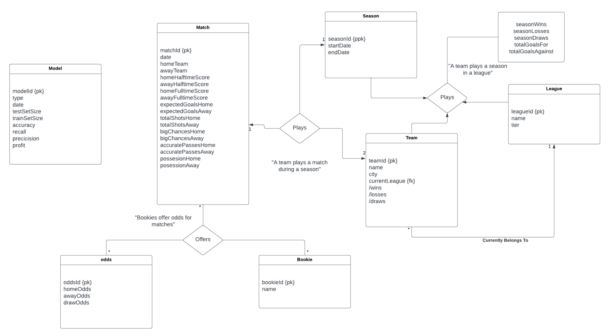
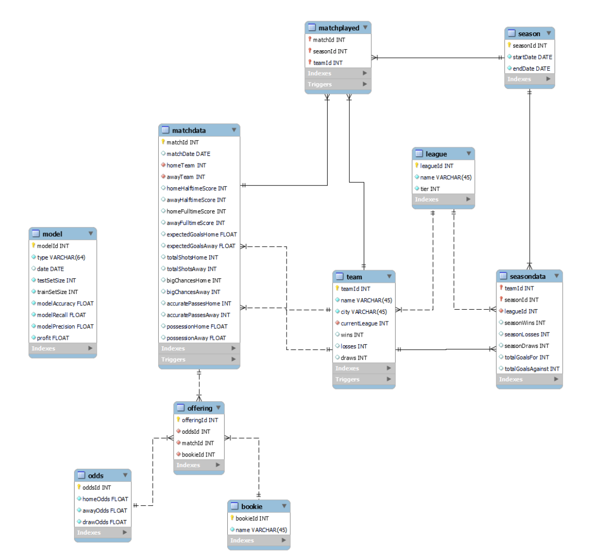
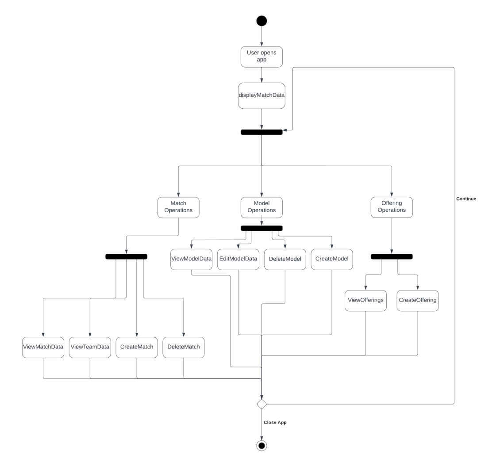

# CS5200

Project Description/Motivation:
Over the past year a roommate of mine (Jason) has been working on a machine learning
application to predict the winner of soccer games using halftime data. The model, in conjunction
with halftime betting odds, is used to determine profit/loss using a rolling bankroll over test data.
I have helped in some aspects, and wanted to contribute in a more meaningful way than training
and testing models.
For this project, we wanted to develop a graphical application that could be used to better
visualize both the halftime data we have collected, as well as the data from models we have
trained. For the purposes of the project, some tables, such as the match data, have been
simplified to better follow the rules outlined in the course, rather than be used directly for the
machine learning application. Additionally, while we had access to a large amount of web
scraped data, we chose to generate simpler data to make everything more readable, and avoid
cleaning the data.
In the future, we hope to expand on this to better suit the machine learning needs.

Data Description:
The following is a description of each of the tables (excluding relationships) we are storing in
our database:
Matches: Will store data relevant to the match. This will include the score for each side (at
halftime and fulltime), the date of the match, the teams playing in the match, and stats for each
team at halftime.
Teams: This will include the team name, the league they play in, and their record (derived from
matches).
Leagues: This will store the names and tiers of the various leagues the teams play in.
Seasons: This will store the start and end date of each of the seasons we are covering.
SeasonData: This will store the seasonal statistics for each time.
Odds: This will include the odds for a home win, away win, and draw for each match, offered by
each bookie.
Bookies: This will store just the name of the bookie.
Models: This will include data relevant to the machine learning algorithms generated from the
data, including the model type and creation date, as well as model heuristics and profitability
using a rolling bankroll on the test set.

Technical Specifications:
The database was created using MySQL (this is a SQL database) and the front-end code was
done in Html, CSS and Javascript. We utilized the Django web framework for the backend which
is a Python based framework and hosted the website locally to view and manipulate the data. We
have pymysql to connect to the database from the python.

Conceptual Design:

Logical Design:

User Flow:

Lessons Learned:
1. Technical expertise gained
During this project we learned a lot about integrating mysql into python and specifically
the Django framework. There were certain instances where calls within mysql
functioned normally but failed within python. This required a fair deal of
troubleshooting and learning how strings and requests needed to be formatted on the
python side in order to have the correct effect on the sql table.
Additionally, we quickly learned how complicated sql procedures and triggers can
become as the database grows and becomes more complex. Even with the comparatively
simple database design we chose, there were many conditions that needed to be checked,
both within sql and within python, to ensure user input was received correctly, and the
user was prohibited from accessing or manipulating data that they should not be.
2. Insights, time management insights, data domain insights etc.
One thing we did very well was time management. We met weekly and discussed the
state of the project, as well as separated tasks between us (mostly split between working
on the frontend and backend size) to ensure we did not fall behind. This left us time at
the end for testing.
Additionally, we learned a decent amount about soccer statistics and how European
betting odds worked, which may prove to be beneficial to us at some point.
3. Realized or contemplated alternative design / approaches to the project
Something we discussed doing instead of a web based design was creating a local app
using tkinter. However, the end goal of the machine learning side of the project is to
view this data on a website, so it made more sense to pursue this route.

Future Work:
1. Planned uses of the database
As discussed, the plan is to integrate our work with the machine learning side. This
would involve expanding the match data table to include everything relevant for the
model, or at least the ability to extrapolate needed data from the database. We have access
to a large amount of webscraped data, so this would need to be cleaned and reformatted
in order to be integrated into the database. In the end, the application would serve as a
better way to view all of the match data, and the models that have been tested, as well as
visualize this data. After we have developed a model that is fairly accurate/profitable, we
would like to share predictions on a website, which would use the database as a backend.
2. Potential areas for added functionality
There are a few key additions that we would hope to include.
● Firstly, the user should be able to easily generate new models on the frontend.
This would involve a more complex way to store the model data, as well as the
machine learning code directly linked to the frontend.
● Additionally, we would want to expand the matchdata/seasondata tables to
include more statistics, as this would be necessary for the machine learning
algorithms.
● We would also want to automate the webscraping so that new match data would
be collected and immediately inserted into the database.
● We would also like to further the complexity of the database by taking into
account relegation. This is a concept in soccer where teams at the bottom of a
league are demoted to a lower tiered league, and teams at the top of a league are
promoted to a high tiered league (like if a major league baseball team were
demoted to the minors and vice versa). This is a real life aspect of the game which
we were not able to incorporate into our schema.

